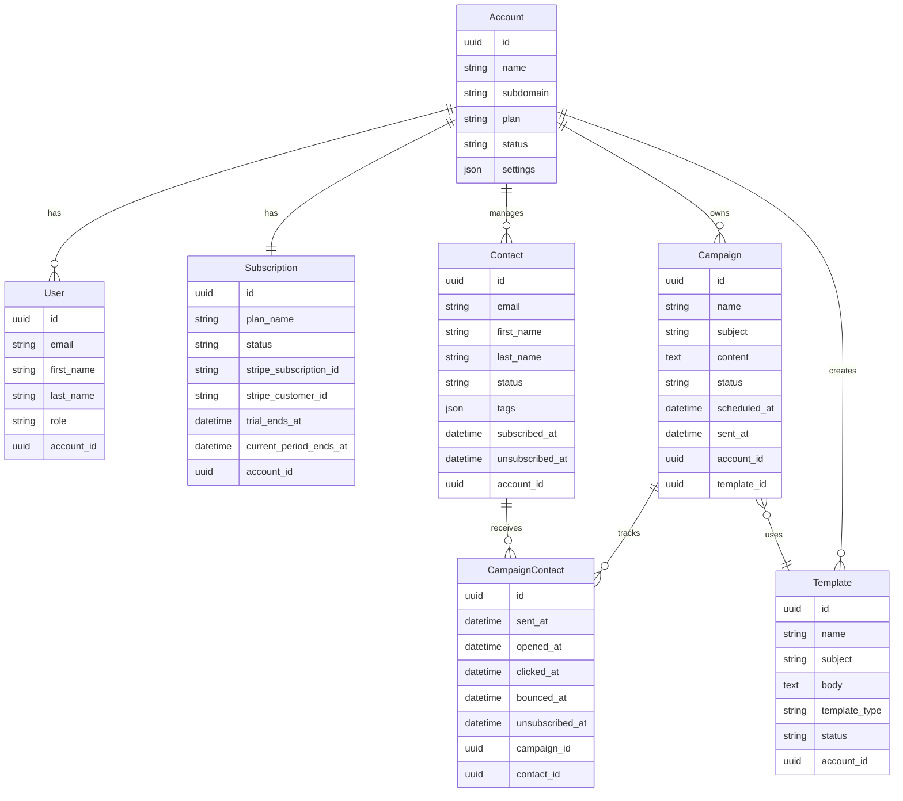

# RapidMarkt System Architecture

## Overview

RapidMarkt is a comprehensive AI-powered marketing platform designed specifically for indie solopreneurs and small-to-medium enterprises (SMEs). The platform provides a multi-tenant SaaS solution that enables users to create, manage, and analyze marketing campaigns across multiple channels including email, social media, and content marketing with AI-powered features and automation capabilities.

## Design Philosophy

### User Experience Principles
- **Solopreneur-First**: Simplified workflows optimized for single-person operations and SMEs
- **Professional Aesthetics**: Clean, modern interface with quality iconography
- **Hierarchical Design**: Clear information architecture and visual hierarchy
- **Responsive Excellence**: Seamless experience across all devices
- **Accessibility**: WCAG 2.1 AA compliant design
- **Multi-Channel**: Unified platform for email, social media, content marketing, and analytics

### Technical Principles
- **Domain-Driven Design**: Clear separation of business domains
- **Test-Driven Development**: Comprehensive test coverage
- **Clean Architecture**: Separation of concerns and modular design
- **Performance-First**: Optimized for speed and scalability
- **Security by Design**: Built-in security measures at every layer
- **AI Integration**: Leveraging AI for content generation, campaign optimization, audience insights, and cross-channel marketing automation

## System Architecture

### High-Level Architecture

```
┌─────────────────────────────────────────────────────────────┐
│                    Presentation Layer                       │
├─────────────────────────────────────────────────────────────┤
│  Web Interface  │  API Gateway  │  Mobile PWA  │  Webhooks  │
├─────────────────────────────────────────────────────────────┤
│                   Application Layer                         │
├─────────────────────────────────────────────────────────────┤
│  Controllers  │  Services  │  Jobs  │  Policies  │  Helpers  │
├─────────────────────────────────────────────────────────────┤
│                     Domain Layer                            │
├─────────────────────────────────────────────────────────────┤
│   Models   │  Validators  │  Concerns  │  Value Objects     │
├─────────────────────────────────────────────────────────────┤
│                 Infrastructure Layer                        │
├─────────────────────────────────────────────────────────────┤
│ Database │ Email Service │ File Storage │ External APIs     │
└─────────────────────────────────────────────────────────────┘
```

### Core Domains

#### 1. Account Management Domain
- **Multi-tenancy**: Account-based isolation
- **Subscription Management**: Stripe integration for billing
- **User Management**: Role-based access control
- **Plan Limitations**: Feature gating based on subscription tiers

#### 2. Email Marketing Domain
- **Campaign Management**: Create, schedule, and track campaigns
- **Contact Management**: Segmentation and list management
- **Template System**: Drag-and-drop email builder
- **Analytics**: Open rates, click tracking, engagement metrics
- **A/B Testing**: Multi-variate testing and optimization

#### 3. Social Media Marketing Domain
- **Multi-platform Scheduling**: Content scheduling across social networks
- **Social Analytics**: Engagement tracking and performance metrics
- **Audience Management**: Cross-platform audience insights
- **Content Calendar**: Visual content planning and coordination

#### 4. Content Generation Domain
- **AI Integration**: OpenAI GPT-4 for multi-channel content creation
- **Template Library**: Pre-built content templates for all channels
- **Brand Voice**: Consistent messaging across campaigns
- **Content Optimization**: A/B testing and performance insights
- **SEO Optimization**: AI-powered content optimization for search

#### 5. Automation Domain
- **Workflow Builder**: Visual automation designer
- **Trigger System**: Event-based campaign triggers
- **Drip Campaigns**: Automated email sequences
- **Behavioral Targeting**: User action-based segmentation
- **Cross-Channel Automation**: Coordinated multi-channel campaigns

## Data Architecture

### Core Entities



## Technology Stack

### Backend
- **Framework**: Ruby on Rails 8
- **Database**: PostgreSQL 16
- **Cache**: Redis 7
- **Background Jobs**: Solid Queue
- **File Storage**: Active Storage with S3
- **Email Delivery**: Action Mailer with SendGrid/Postmark
- **Social Media APIs**: Twitter API, Facebook Graph API, LinkedIn API, Instagram API
- **Webhooks**: For real-time integrations

### Frontend
- **Framework**: Hotwire (Turbo + Stimulus)
- **Styling**: TailwindCSS 3.4
- **Icons**: Heroicons + Lucide Icons
- **Charts**: Chart.js for analytics dashboards
- **Rich Text**: Trix Editor for content creation
- **Drag & Drop**: SortableJS
- **Calendar**: FullCalendar for content scheduling

### AI/ML
- **Content Generation**: OpenAI GPT-4 API for multi-channel content
- **Image Generation**: DALL-E or Midjourney API for visual content
- **Analytics**: Custom ML models for cross-channel insights
- **Optimization**: Multi-variate testing frameworks
- **SEO**: AI-powered content optimization

### Infrastructure
- **Deployment**: Kamal 2.0
- **Monitoring**: Rails built-in error reporting
- **Analytics**: Custom dashboard with PostgreSQL
- **CDN**: CloudFlare for global content delivery
- **SSL**: Let's Encrypt via Kamal
- **Rate Limiting**: For API usage optimization

### External Services
- **Payment Processing**: Stripe
- **Email Delivery**: SendGrid/Postmark
- **AI Content**: OpenAI GPT-4
- **File Storage**: AWS S3
- **DNS**: CloudFlare
- **Social Platforms**: Native APIs for major social networks
- **Analytics**: Google Analytics, Facebook Pixel integration
- **CRM**: Zapier integration for workflow automation

## Security Architecture

### Authentication & Authorization
- **Authentication**: Devise with secure session management
- **Authorization**: Pundit policies for fine-grained access control
- **Multi-tenancy**: Account-based data isolation
- **API Security**: JWT tokens for API access

### Data Protection
- **Encryption**: Database encryption at rest
- **HTTPS**: TLS 1.3 for all communications
- **CSRF Protection**: Rails built-in CSRF tokens
- **SQL Injection**: Parameterized queries
- **XSS Protection**: Content Security Policy headers

### Privacy & Compliance
- **GDPR Compliance**: Data export and deletion capabilities
- **CAN-SPAM**: Automatic unsubscribe handling
- **Data Retention**: Configurable data retention policies
- **Audit Logging**: Comprehensive activity tracking

## Performance Architecture

### Caching Strategy
- **Page Caching**: Turbo-powered page caching
- **Fragment Caching**: Component-level caching
- **Query Caching**: ActiveRecord query caching
- **Redis Caching**: Session and application data

### Database Optimization
- **Indexing**: Strategic database indexes
- **Query Optimization**: N+1 query prevention
- **Connection Pooling**: Optimized connection management
- **Read Replicas**: Separate read/write operations

### Asset Optimization
- **Asset Pipeline**: Rails 8 asset pipeline
- **Image Optimization**: WebP format with fallbacks
- **CSS Purging**: TailwindCSS purging
- **JavaScript Bundling**: Import maps

## Scalability Architecture

### Horizontal Scaling
- **Load Balancing**: Application load balancer
- **Database Sharding**: Account-based sharding strategy
- **Background Jobs**: Distributed job processing
- **CDN**: Global content distribution

### Vertical Scaling
- **Resource Monitoring**: CPU, memory, and disk monitoring
- **Auto-scaling**: Container-based scaling
- **Database Scaling**: Connection pooling and optimization
- **Cache Scaling**: Redis cluster configuration

## User Interface Architecture

### Design System

#### Color Palette
```css
/* Primary Colors */
--primary-50: #eff6ff;
--primary-500: #3b82f6;
--primary-600: #2563eb;
--primary-700: #1d4ed8;

/* Secondary Colors */
--secondary-50: #f8fafc;
--secondary-500: #64748b;
--secondary-600: #475569;
--secondary-700: #334155;

/* Success Colors */
--success-50: #f0fdf4;
--success-500: #22c55e;
--success-600: #16a34a;

/* Warning Colors */
--warning-50: #fffbeb;
--warning-500: #f59e0b;
--warning-600: #d97706;

/* Error Colors */
--error-50: #fef2f2;
--error-500: #ef4444;
--error-600: #dc2626;
```

#### Typography Scale
```css
/* Headings */
.text-4xl { font-size: 2.25rem; line-height: 2.5rem; }
.text-3xl { font-size: 1.875rem; line-height: 2.25rem; }
.text-2xl { font-size: 1.5rem; line-height: 2rem; }
.text-xl { font-size: 1.25rem; line-height: 1.75rem; }
.text-lg { font-size: 1.125rem; line-height: 1.75rem; }

/* Body Text */
.text-base { font-size: 1rem; line-height: 1.5rem; }
.text-sm { font-size: 0.875rem; line-height: 1.25rem; }
.text-xs { font-size: 0.75rem; line-height: 1rem; }
```

#### Spacing System
```css
/* Spacing Scale (Tailwind) */
.space-1 { margin: 0.25rem; }
.space-2 { margin: 0.5rem; }
.space-4 { margin: 1rem; }
.space-6 { margin: 1.5rem; }
.space-8 { margin: 2rem; }
.space-12 { margin: 3rem; }
.space-16 { margin: 4rem; }
```

### Component Architecture

#### Layout Components
- **AppShell**: Main application layout with sidebar
- **Navigation**: Responsive navigation with mobile menu
- **Sidebar**: Collapsible sidebar with navigation items
- **Header**: Top header with user menu and notifications
- **Footer**: Application footer with links and branding

#### UI Components
- **Button**: Primary, secondary, and tertiary button variants
- **Card**: Content containers with shadows and borders
- **Modal**: Overlay dialogs for forms and confirmations
- **Table**: Data tables with sorting and pagination
- **Form**: Form components with validation states

#### Business Components
- **CampaignBuilder**: Drag-and-drop email campaign builder
- **ContactTable**: Contact management with filtering
- **AnalyticsDashboard**: Charts and metrics display
- **TemplateLibrary**: Template selection and preview
- **AutomationWorkflow**: Visual workflow builder

### Responsive Design

#### Breakpoints
```css
/* Mobile First Approach */
sm: 640px   /* Small devices */
md: 768px   /* Medium devices */
lg: 1024px  /* Large devices */
xl: 1280px  /* Extra large devices */
2xl: 1536px /* 2X Extra large devices */
```

#### Grid System
```css
/* 12-column grid system */
.grid-cols-1 { grid-template-columns: repeat(1, minmax(0, 1fr)); }
.grid-cols-2 { grid-template-columns: repeat(2, minmax(0, 1fr)); }
.grid-cols-3 { grid-template-columns: repeat(3, minmax(0, 1fr)); }
.grid-cols-4 { grid-template-columns: repeat(4, minmax(0, 1fr)); }
.grid-cols-12 { grid-template-columns: repeat(12, minmax(0, 1fr)); }
```

## API Architecture

### RESTful API Design

#### Resource Endpoints
```
GET    /api/v1/campaigns           # List campaigns
POST   /api/v1/campaigns           # Create campaign
GET    /api/v1/campaigns/:id       # Show campaign
PUT    /api/v1/campaigns/:id       # Update campaign
DELETE /api/v1/campaigns/:id       # Delete campaign

GET    /api/v1/contacts            # List contacts
POST   /api/v1/contacts            # Create contact
GET    /api/v1/contacts/:id        # Show contact
PUT    /api/v1/contacts/:id        # Update contact
DELETE /api/v1/contacts/:id        # Delete contact

GET    /api/v1/templates           # List templates
POST   /api/v1/templates           # Create template
GET    /api/v1/templates/:id       # Show template
PUT    /api/v1/templates/:id       # Update template
DELETE /api/v1/templates/:id       # Delete template
```

#### Response Format
```json
{
  "data": {
    "id": "uuid",
    "type": "campaign",
    "attributes": {
      "name": "Welcome Series",
      "subject": "Welcome to RapidMarkt!",
      "status": "draft",
      "created_at": "2024-01-15T10:30:00Z",
      "updated_at": "2024-01-15T10:30:00Z"
    },
    "relationships": {
      "template": {
        "data": { "id": "uuid", "type": "template" }
      }
    }
  },
  "included": [],
  "meta": {
    "total_count": 1,
    "page": 1,
    "per_page": 25
  }
}
```

### Webhook Architecture

#### Event Types
- `campaign.sent` - Campaign successfully sent
- `campaign.failed` - Campaign failed to send
- `contact.subscribed` - New contact subscribed
- `contact.unsubscribed` - Contact unsubscribed
- `email.opened` - Email opened by recipient
- `email.clicked` - Link clicked in email
- `email.bounced` - Email bounced

#### Webhook Payload
```json
{
  "id": "evt_uuid",
  "type": "campaign.sent",
  "created_at": "2024-01-15T10:30:00Z",
  "data": {
    "campaign_id": "uuid",
    "account_id": "uuid",
    "sent_count": 1250,
    "sent_at": "2024-01-15T10:30:00Z"
  }
}
```

## Deployment Architecture

### Production Environment

#### Infrastructure
- **Application Server**: 2x 4GB RAM, 2 CPU cores
- **Database Server**: 1x 8GB RAM, 4 CPU cores
- **Redis Server**: 1x 2GB RAM, 1 CPU core
- **Load Balancer**: CloudFlare with SSL termination
- **File Storage**: AWS S3 with CloudFront CDN

#### Deployment Pipeline
```yaml
# .github/workflows/deploy.yml
name: Deploy to Production
on:
  push:
    branches: [main]

jobs:
  deploy:
    runs-on: ubuntu-latest
    steps:
      - uses: actions/checkout@v4
      - name: Setup Ruby
        uses: ruby/setup-ruby@v1
        with:
          bundler-cache: true
      - name: Run Tests
        run: bundle exec rspec
      - name: Deploy with Kamal
        run: kamal deploy
        env:
          KAMAL_REGISTRY_PASSWORD: ${{ secrets.KAMAL_REGISTRY_PASSWORD }}
```

### Monitoring & Observability

#### Application Monitoring
- **Error Tracking**: Rails built-in error reporting
- **Performance Monitoring**: Rails performance insights
- **Uptime Monitoring**: External uptime service
- **Log Aggregation**: Centralized logging with structured logs

#### Business Metrics
- **Campaign Performance**: Open rates, click rates, conversion rates
- **User Engagement**: Daily/monthly active users
- **Revenue Metrics**: MRR, churn rate, LTV
- **System Health**: Response times, error rates, throughput

## Development Workflow

### Git Workflow
```
main (production)
├── develop (staging)
│   ├── feature/email-templates
│   ├── feature/campaign-analytics
│   └── feature/ai-content-generation
└── hotfix/critical-bug-fix
```

### Code Quality
- **Linting**: RuboCop with custom configuration
- **Testing**: RSpec with 90%+ coverage requirement
- **Security**: Brakeman security scanning
- **Dependencies**: Bundler audit for vulnerability scanning

### Development Environment
```bash
# Setup
bin/setup

# Start development server
bin/dev

# Run tests
bin/rspec

# Code quality checks
bin/rubocop
bin/brakeman
```

## Future Considerations

### Planned Features
- **Mobile App**: React Native mobile application
- **Advanced Analytics**: Machine learning insights
- **Social Media Integration**: Multi-platform posting
- **Advanced Automation**: Complex workflow builder
- **White-label Solution**: Custom branding options

### Scalability Roadmap
- **Microservices**: Extract email sending to separate service
- **Event Sourcing**: Implement event-driven architecture
- **GraphQL**: Add GraphQL API alongside REST
- **Real-time Features**: WebSocket integration for live updates
- **International**: Multi-language and multi-currency support

---

*This architecture document serves as the foundation for building RapidMarkt, a world-class email marketing platform designed specifically for indie solopreneurs who demand professional tools without enterprise complexity.*